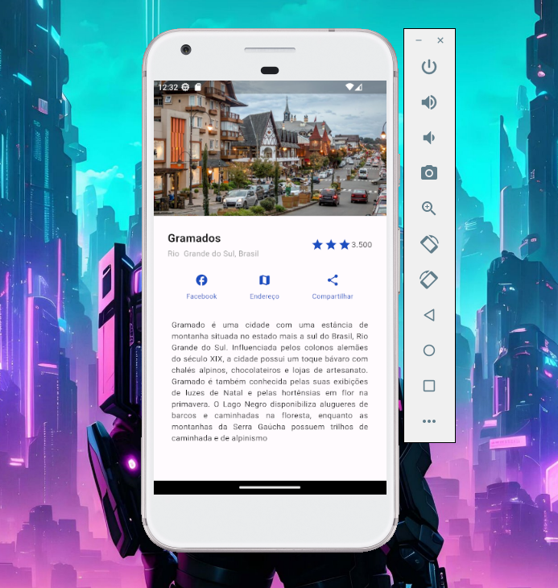

<h1 align="center"> Atividade Avaliativa de Dart com Flutter  </h1>

Atividade Avaliativa de Dart com Flutter (Em Construção)  
Objeto de estudo na displina Desenvolvimento para Dispositivos Móveis  

 

  

## Tecnologias Utilizadas

- Dart
- Flutter
- Git & GitHub
